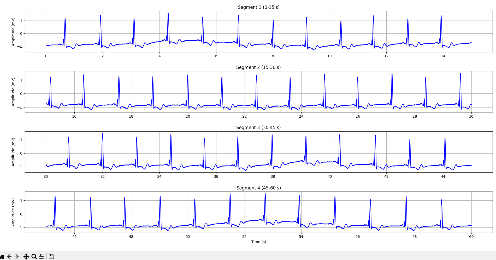
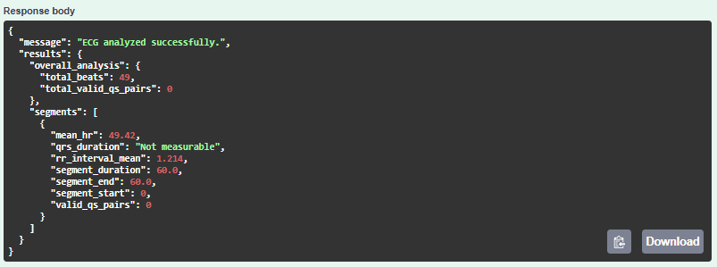
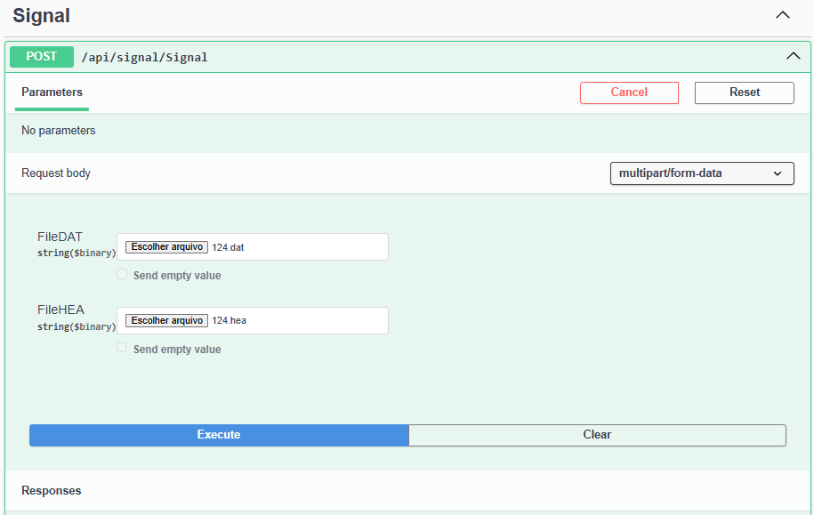

# Biomedical First Medical Platform 

A Python project for clinical ECG signal analysis using WFDB and NeuroKit2.
The system uses a robust ASP.NET API with Swagger interface to receive ECG files (.dat and .hea) through HTTP requests. These files are sent to the Python backend where they are read, interpreted, converted to CSV, and analyzed to extract clinical metrics such as R-peaks, heart rate, and QRS duration. The processed data is then returned to the ASP.NET API as formatted JSON for client consumption.
The initial focus is on analyzing 1-minute ECG segments, providing fast and reliable clinical insights.


## Features

- Robust ASP.NET API with Swagger to receive ECG data files (`.dat` and `.hea`) via HTTP requests
- Python backend for reading, interpreting, and converting ECG data to CSV format
- Read ECG signals in WFDB format
- ECG signal cleaning
- Automatic R-peak detection
- RR interval and average heart rate calculation
- Delineation of P, Q, R, S, and T waves
- QRS complex duration calculation
- Segmented analysis (currently 1-minute segments)
- Easily extensible for longer or multiple segment analyses
- Results returned as JSON via the ASP.NET API for easy integration with clients


## ECG signals with Matplot



## Data analysis using POST with ASP.NET




## DAT & HEA files reading and converting to CSV



## API Documentation

#### Return the data from DAT archive(binary) with read rules(HEA)

```http
  POST /api/signal/Signal

```

| Parameters   | Type       | Description                           |
| :---------- | :--------- | :---------------------------------- |
| `File.DAT` | `string($binary)	` | ECG data file (.dat)	|
| `File.HEA` | `string($binary)	` | ECG data file (.hea)    |


## Installation

To run the project, make sure you have Python installed (version 3.7 or higher).

Install the required dependencies with:

``` bash

pip install wfdb neurokit2 numpy
```
## Improvements

- Optimize ECG processing to handle longer recordings efficiently  
- Implement real-time ECG streaming and analysis support  
- Enhance QRS complex detection accuracy with advanced algorithms  
- Add support for multi-lead ECG signals  
- Develop a frontend dashboard to visualize ECG signals and analysis results  
- Extend API endpoints for batch processing and additional clinical metrics  
- Integrate unit and integration tests for robustness and reliability  
- Provide detailed error handling and logging mechanisms  
- Containerize the Python and ASP.NET components with Docker for easier deployment  
- Add user authentication and authorization to secure the API  

## About Me

I am a Computer Engineering student and work as a .NET back-end developer with experience in Python.  
I have studied STEM and computer science courses at Harvard and Stanford, including CS50x and Mathematical Thinking, and I participate in the Aspire Leaders program.  
In the future, I plan to pursue a career in biomedical engineering, specifically in computational neuroengineering.

## License

[MIT](https://choosealicense.com/licenses/mit/)

